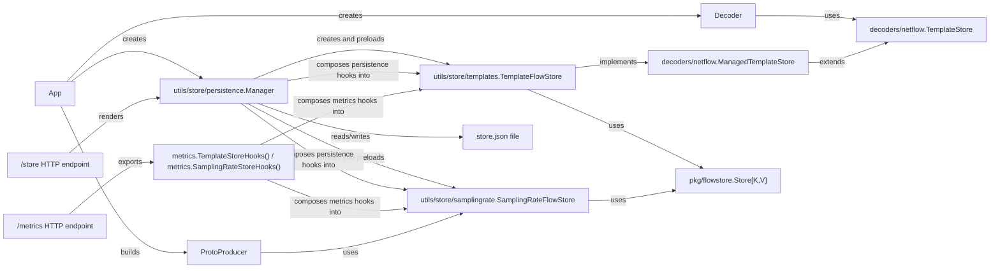
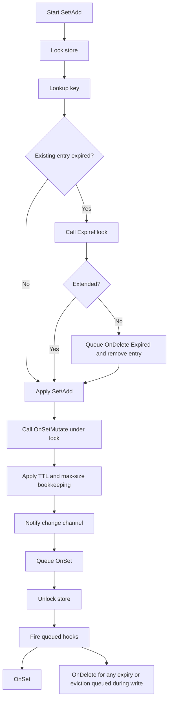
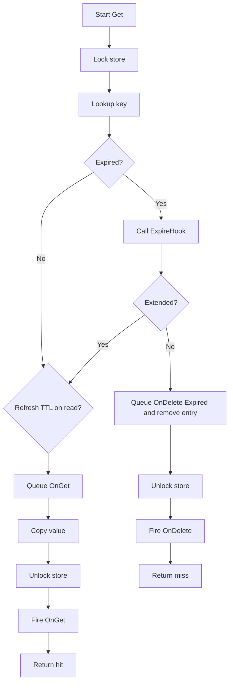
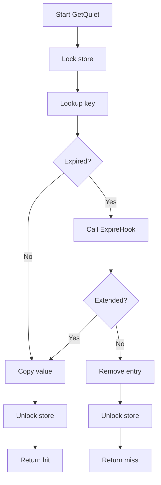
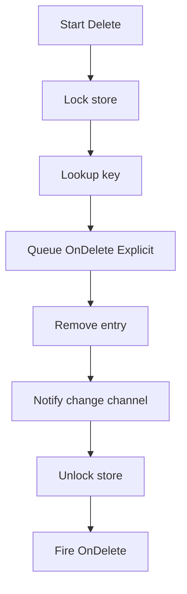
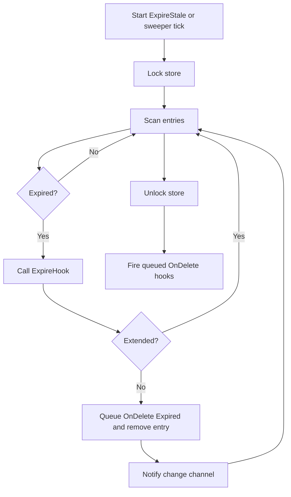
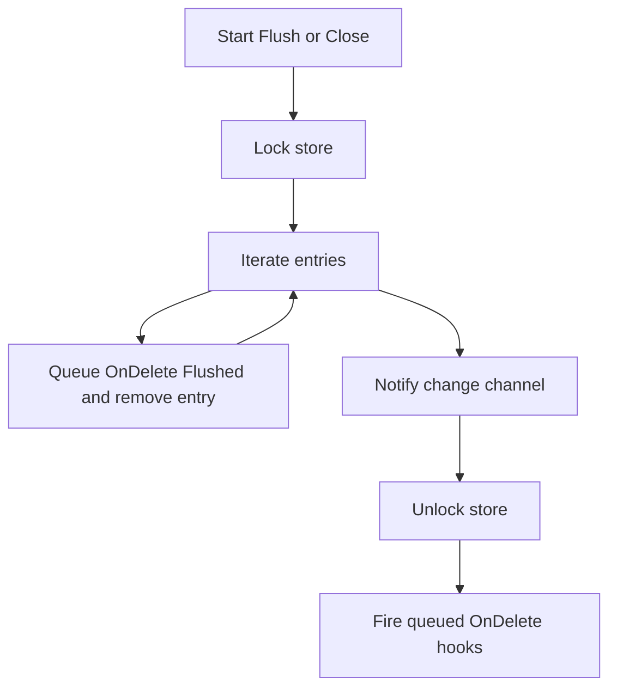

# FlowStore

This document describes the generic `FlowStore` storage model, hook behavior, expiry model, and the relationships between the FlowStore-backed store layers.

## Overview

`FlowStore` is the generic storage primitive in `pkg/flowstore/store.go`. It provides a reusable in-memory key/value store with:

* generic keys and values
* `Set` and `Add` semantics
* optional TTL expiry
* optional refresh-on-read and refresh-on-write
* FIFO eviction
* hooks for set, get, and delete events
* lifecycle helpers such as sweepers, `Start()`, and `Close()`

`Set` is the main access path for the FlowStore-backed wrappers in this repository, including template access and sampling-rate storage. `Add` is intended for aggregated values such as counters, where a delta is merged into an existing entry instead of replacing it.

`FlowStore` itself is intentionally protocol-agnostic. It does not know anything about NetFlow, IPFIX, templates, or counters. It is only the storage engine.

In this repository, the two main uses of `FlowStore` are template access and flow counters. Template access is implemented in the template and sampling-rate stores and mainly relies on `Set`. Counter-style aggregation is demonstrated in `pkg/flowstore` with `FlowIPv4Key`, `FlowCounters`, and `FlowTimestamp`, where `Add` merges packet, byte, and timestamp updates into an existing flow entry.

## Expiry

FlowStore supports both manual and automatic expiration control.

Manual control:

* `ExpireStale()` removes expired entries immediately.
* `WithTTL(ttl)` sets a per-write TTL.
* `WithoutExpiration()` disables expiration for a specific entry.

Automatic control:

* `WithDefaultTTL(ttl)` sets the default TTL for new entries.
* `StartSweeper(interval)` or `Start(interval)` enables periodic expiry checks.

TTL extension modes:

* none
  Entries expire once their TTL elapses.
* on write
  `WithRefreshTTLOnWrite()` refreshes TTL on `Set` and `Add`.
* on read and write
  `WithRefreshTTLOnWrite()` together with `WithRefreshTTLOnRead()` refreshes TTL on both updates and `Get`.

Typical choices depend on the workload:

* Templates can safely extend on read and write. As long as the decoder keeps reading a template, keeping it in memory is usually the desired behavior.
* Counters often use no extension when they should reset periodically.
* Counters can also use write-only extension when active writes should keep them alive, but idle counters should still age out.
* For continuous counters, disable expiration entirely. Those counters can be dumped periodically through a separate hook or flush path instead of relying on TTL.

`FlowCounters` is only a base building block. It can be embedded into a richer value type and combined with additional fields such as strings, timestamps, identifiers, or other per-flow state, as long as the resulting value implements the behaviors needed by `Set` and `Add`.

## List Keys

FlowStore exposes `Range(...)` to iterate over all live entries in FIFO order. `Range` also prunes stale entries before iteration, so the traversal acts on the current in-memory view.

FlowStore can also limit the number of stored keys with `WithMaxSize(max)`. When the limit is exceeded, the oldest entries are evicted in FIFO order, and those removals are reported as `DeleteReasonEvicted`.

Higher-level stores build snapshot helpers on top of that:

* `(*TemplateFlowStore).GetAll()`
* `(*SamplingRateFlowStore).GetAll()`

For dump-style workflows, callers typically iterate or snapshot the store and then serialize the result. In the current application wiring, JSON serialization is owned by the shared persistence manager rather than by the stores themselves.

## Store Relationships

So the layering is:

* `pkg/flowstore.Store[K,V]`
  Generic storage engine
* `decoders/netflow.TemplateStore`
  Minimal decoder-facing template interface
* `decoders/netflow.ManagedTemplateStore`
  Lifecycle and operational template interface
* `utils/store/templates.TemplateFlowStore`
  Template-specific implementation backed by `FlowStore`
* `utils/store/samplingrate.SamplingRateFlowStore`
  Sampling-rate implementation backed by `FlowStore`
* `metrics.TemplateStoreHooks()` / `metrics.SamplingRateStoreHooks()`
  Prometheus hook adapters for template and sampling-rate stores
* `utils/store/persistence.Manager`
  Shared JSON preload, flush, and HTTP document manager

The decoder depends only on `TemplateStore`. The application wiring uses `TemplateFlowStore` and `SamplingRateFlowStore` directly. Prometheus integration is attached through composed store hooks rather than wrapper stores. The producer uses `SamplingRateFlowStore` to resolve sampling-rate state while encoding flows. JSON preload and flush are handled by `persistence.Manager`, which creates the template and sampling-rate stores, composes persistence hooks into them, and owns the shared `store.json` document and `/store` HTTP rendering.

## Hook Model

`FlowStore` defines four hook types:

* `OnSetMutate`
  Runs under the store lock after `Set` or `Add` mutates a value. It receives `*V` and may modify the stored value in place.
* `OnSet`
  Runs after the store lock is released for completed `Set` and `Add` operations.
* `OnGet`
  Runs after the store lock is released for `Get`. It is not fired by `GetQuiet`.
* `OnDelete`
  Runs after the store lock is released when an entry is removed explicitly, expired, evicted, or flushed.

## Operation Flow

### `Set` and `Add`

Behavior:

* `OnSetMutate` runs under lock and can change the stored value.
* `OnSet` runs after unlock and observes the completed write.
* If `WithMaxSize(max)` evicts older entries during the write, each eviction queues `OnDelete(..., DeleteReasonEvicted)`.

### `Get`

Behavior:

* `Get` may extend TTL if `WithRefreshTTLOnRead()` is enabled.
* `OnGet` fires only for `Get`, not for `GetQuiet`.
* If an expired entry is not extended, `OnDelete(..., DeleteReasonExpired)` is fired.

### `GetQuiet`

Behavior:

* `GetQuiet` does not queue `OnGet`.
* `GetQuiet` does not refresh TTL on read.

### `Delete`

### `ExpireStale` and Sweeper

### `Flush` and `Close`

## Delete Reasons

`OnDelete` may be fired with:

* `DeleteReasonExplicit`
* `DeleteReasonExpired`
* `DeleteReasonEvicted`
* `DeleteReasonFlushed`

## Summary

* `OnSetMutate` changes stored values during `Set` and `Add`.
* `OnSet` observes completed writes.
* `OnGet` observes `Get`, but not `GetQuiet`.
* `OnDelete` reports explicit deletes, expiry, eviction, and flushes.
