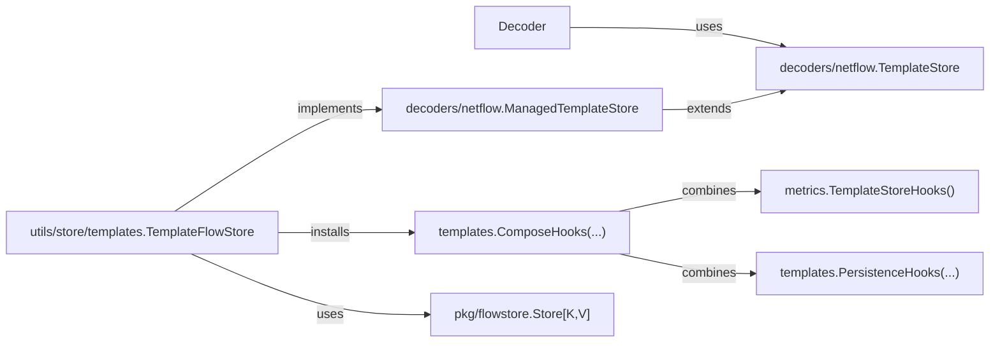

# TemplateStore

This document describes template storage and template-specific wiring. Generic `FlowStore` behavior and shared store relationships are documented in [`docs/flowstore.md`](./flowstore.md).

## TemplateStore

The template API lives in `decoders/netflow/template_store.go`.

* `netflow.FlowContext`
  Carries routing metadata for template operations. Right now it contains `RouterKey`, which is used as the per-router namespace.
* `netflow.TemplateStore`
  The FlowStore-backed template interface used by the decoder.
* `netflow.ManagedTemplateStore`
  Extends `TemplateStore` with lifecycle and operational methods such as `RemoveTemplate`, `GetAll`, `Start`, `Close`, and `Errors`.

The decoder receives a `TemplateStore` and a `FlowContext` and calls the store directly. In practice, decoding uses `AddTemplate` for template sets and `GetTemplate` for data sets; lifecycle methods such as `Start`, `Close`, and `Errors` belong to `ManagedTemplateStore` and are used by the surrounding application wiring.

### `utils/store/templates.TemplateFlowStore`

File: `utils/store/templates/store.go`

This is the primary `ManagedTemplateStore` implementation. It uses `FlowStore` underneath and adds:

* template-specific keys made of router, version, observation domain, and template ID
* the decoder-facing `TemplateStore` interface
* template lifecycle hooks
* collector wiring
* shared-store persistence and metrics hooks

It stores templates in `pkg/flowstore.Store` using a composite key:

* `RouterKey`
* `Version`
* `ObsDomainID`
* `TemplateID`

It supports:

* in-memory storage
* TTL expiry
* optional TTL refresh on access
* background sweeping
* lifecycle hooks for add, access, and remove events
* runtime hook composition through `templates.ComposeHooks(...)`
* an error channel for asynchronous store errors

Constructor:

* `templates.NewTemplateFlowStore(opts ...FlowStoreOption)`

Knobs:

* `templates.WithTTL(ttl)`
  Set a default TTL for template entries. `0` disables expiry.
* `templates.WithExtendOnAccess(enable)`
  Refresh TTL on reads.
* `templates.WithSweepInterval(interval)`
  Control the periodic expiry sweep interval.
* `templates.WithHooks(hooks)`
  Register lifecycle callbacks:
  * `OnAdd`
  * `OnAccess`
  * `OnRemove`
* `templates.WithNow(nowFn)`
  Override the clock for tests.

Lifecycle:

* `Start()`
  Starts the background sweeper.
* `Close()`
  Stops background work and closes the error channel.
* `Errors()`
  Returns asynchronous store errors. Shared JSON persistence errors come from `persistence.Manager`.

### `metrics.TemplateStoreHooks`

File: `metrics/store_hooks.go`

This is a Prometheus hook adapter for template-store lifecycle events. It does not own storage. It records metrics on:

* template add
* template update
* template access
* template removal
* current live template entries

It is intended to be composed with other hook consumers, such as persistence hooks:

* `templates.ComposeHooks(metrics.TemplateStoreHooks(), templates.PersistenceHooks(...))`

### Test implementation

File: `decoders/netflow/netflow_test.go`

`testTemplateStore` is a test-only implementation used by decoder tests.

## Adding another implementation

Any replacement managed store should implement `netflow.ManagedTemplateStore` and should:

* key templates by router, version, observation domain, and template ID
* support `GetAll()` snapshots
* allow preload before `Start()`
* define clear `Start()` and `Close()` semantics
* expose `Errors()` if it performs background persistence or async work
